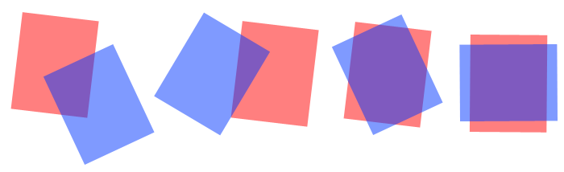

# Differentiable IoU of Oriented Boxes

(image source: [here](https://stackoverflow.com/questions/11670028/area-of-intersection-of-two-rotated-rectangles))
## Introduction
This repo is an unofficial implementation of [IoU Loss for 2D/3D Object Detection](https://arxiv.org/pdf/1908.03851.pdf). It contains the Pytorch function which calculates the intersection area of oriented rectangles using GPU.

## Note
The CUDA extension is modified recently to cover some corner cases. Please consider to update the code and re-compile the extension.

## Check List
- [x] Pytorch function to find intersection points of oriented rectangles
- [x] Pytorch function to check if corners of one rectangle lie in another 
- [x] CUDA extension to anti-clockwise sort vertices of the intersection polygon of two rectangles
- [x] Pytorch function to calculate the intersection of area of rectangles using functions above
- [x] Test cases
- [x] Rotated 2d/3d GIoU and DIoU loss
- [x] Demo to validate the back-propagation
- [ ] Validate 2d/3d IoU loss in Object detection

## Requirements
Code is tested on Ubuntu 18.04. Following dependencies are needed

    cudatoolkit=10.2
    pytorch=1.5         # newer version should work as well
    numpy
    matplotlib
    argparse

## Usage

First, compile the CUDA extension.

    cd cuda_op
    python setup.py install

Then, run a demo which validate the Pytorch functions and CUDA extension.

    cd ..
    python demo.py

This demo trains a network which takes N set of box corners and predicts the `x, y, w, h` and `angle` of each rotated boxes. In order to do the back-prop, the predicted box parameters and the GT are converted to coordinates of box corners. The area of intersection is calculated using the Pytorch function with CUDA extension. Then, the GIoU loss or DIoU loss can be calculated. This demo first generates data and then do the training.

You are expected to see some information like followings:

    ... generating 819200 boxes, please wait...
    ... generating 81920 boxes, please wait...
    data saved in:  ./data
    [Epoch 1: 10/200] train loss: 0.6721  mean_iou: 0.3703
    [Epoch 1: 20/200] train loss: 0.4931  mean_iou: 0.5211
    [Epoch 1: 30/200] train loss: 0.4532  mean_iou: 0.5546
    [Epoch 1: 40/200] train loss: 0.4249  mean_iou: 0.5805
    [Epoch 1: 50/200] train loss: 0.4361  mean_iou: 0.5713
    [Epoch 1: 60/200] train loss: 0.4148  mean_iou: 0.5910
    [Epoch 1: 70/200] train loss: 0.4272  mean_iou: 0.5803
    [Epoch 1: 80/200] train loss: 0.4283  mean_iou: 0.5801
    [Epoch 1: 90/200] train loss: 0.4203  mean_iou: 0.5879

Note the `train loss` drops and the `mean_iou` increases, which shows the functions are differentiable.

## GIoU and DIoU
This repo implements both [GIoU-loss](https://giou.stanford.edu/GIoU.pdf) and [DIoU-loss](https://arxiv.org/abs/1911.08287) for rotated bounding boxes. In the demo, they can be chosen with 

    python demo.py --loss giou      
    python demo.py --loss diou      # [default]

Both losses need the smallest enclosing box of two boxes. Note there are different choices to determin the enclosing box. 

1. axis-aligned box: the enclosing box is axis-aligned. This version is simple and fast but theortically non-optimal.
2. rotated box (approximated): the enclosing box is rotated as well. The size of rotated enclosing box can be estimated using [PCA](https://en.wikipedia.org/wiki/Principal_component_analysis). The calculation if relatively simple but the result is not accurate. In the demo, this methode seems work well.
3. rotated box (accurate): real [smallest enclosing bounding box](https://en.wikipedia.org/wiki/Minimum_bounding_box). Since the brutal force search is used to get the minimum bounding box, the computational cost is high.

The three types of enclosing box can be chosen with:

    python demo.py --enclosing aligned      # simple and naive. bad performance.
    python demo.py --enclosing pca          # approximated smallest box. slightly worse performance.
    python demo.py --enclosing smallest     # [default]. smallest box. best performance.

## Acknowledgement
The idea of calculating intersection area is inspired by this paper:

    @INPROCEEDINGS{8886046,
        author={D. {Zhou} and J. {Fang} and X. {Song} and C. {Guan} and J. {Yin} and Y. {Dai} and R. {Yang}},
        booktitle={2019 International Conference on 3D Vision (3DV)}, 
        title={IoU Loss for 2D/3D Object Detection}, 
        year={2019},
        pages={85-94},}

Some code for CUDA extension is modified from:

    @article{pytorchpointnet++,
        Author = {Erik Wijmans},
        Title = {Pointnet++ Pytorch},
        Journal = {https://github.com/erikwijmans/Pointnet2_PyTorch},
        Year = {2018}
    }

